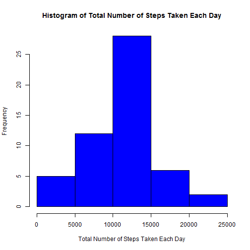
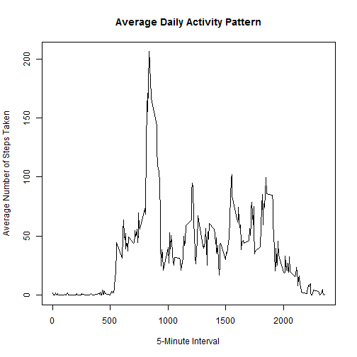
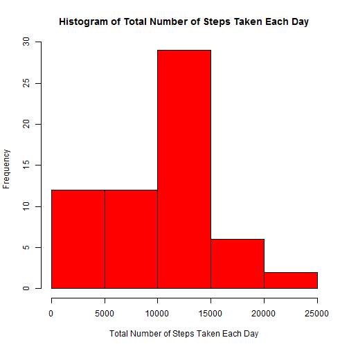

## Loading and preprocessing the data
1. Load the data

```r
# Load CSV Data
actv <-  read.csv("activity.csv")
```
2. Process/transform the data (if necessary) into a format suitable for your analysis

```r
# Convert the date column in actv to date data type
actv$date <- as.Date(actv$date)
```

## What is mean total number of steps taken per day?
For this part of the assignment, you can ignore the missing values in the dataset.

1. Calculate the total number of steps taken per day

```r
# Remove the readings which show no steps or NA
actvsub <-  subset(actv, steps > 0)
# Aggregate the results by day and sum the number of steps for each day
actvagg <- aggregate(actvsub$steps, by=list(date=actvsub$date), FUN=sum, na.rm =TRUE)
```
2. If you do not understand the difference between a histogram and a barplot, research the difference between them. Make a histogram of the total number of steps taken each day.

```r
# Plot the total number of steps taken each day as a Histogram with blue bars
hist(actvagg$x,xlab = "Total Number of Steps Taken Each Day", main = "Histogram of Total Number of Steps Taken Each Day",col="blue")
```

 

3. Calculate and report the mean and median of the total number of steps taken per day

Mean:

```r
# Calculate the mean number of steps per day
mean(actvsub$steps)
```

```
## [1] 134.2607
```

Median:

```r
# Calculate the median number of steps per day
median(actvsub$steps)
```

```
## [1] 56
```

## What is the average daily activity pattern?
1. Make a time series plot (i.e. type = "l") of the 5-minute interval (x-axis) and the average number of steps taken, averaged across all days (y-axis)

```r
#Aggregate activity by interval and take the mean number of steps for each interval
actvaggint <- aggregate(actv$steps, by=list(interval=actv$interval), FUN=mean, na.rm = TRUE)
#Create a time series plot from the interval aggregate
plot(actvaggint$interval,actvaggint$x,type="l",xlab="5-Minute Interval",ylab="Average Number of Steps Taken", main = "Average Daily Activity Pattern") 
```

 

2. Which 5-minute interval, on average across all the days in the dataset, contains the maximum number of steps?

```r
#Find the interval with the maximum number of average steps
actvaggint[actvaggint$x == max(actvaggint$x),]
```

```
##     interval        x
## 104      835 206.1698
```

  Analysis:  The 0835 (military time) interval has the highest average step count of 206.1698 steps.

## Imputing missing values

Note that there are a number of days/intervals where there are missing values (coded as NA). The presence of missing days may introduce bias into some calculations or summaries of the data.

1. Calculate and report the total number of missing values in the dataset (i.e. the total number of rows with NAs)


```r
#Find the total number of missing values in the data
sum(is.na(actv))
```

```
## [1] 2304
```

2. Devise a strategy for filling in all of the missing values in the dataset. The strategy does not need to be sophisticated. For example, you could use the mean/median for that day, or the mean for that 5-minute interval, etc.

My strategy for filling in all of the missing values is to use the mean for the interval to replace all the NAs for that interval.


```r
#Aggregate activity by interval and take the mean number of steps for each interval
actvaggint <- aggregate(actv$steps, by=list(interval=actv$interval), FUN=mean, na.rm = TRUE)
```

3. Create a new dataset that is equal to the original dataset but with the missing data filled in.

```r
#Create a copy of the original dataset named No NA 
#to indicate it will contain No NAs when complete

actvNoNA <- actv

#Write a simple function IntAvg which takes the interval as input
#and returns the average number of steps for that invterval
#using the actvaggint data frame created earlier

IntAvg <- function(intv) {
  intvagg <- actvaggint[actvaggint$interval == intv,2]
  return(intvagg)
}

# Replace the NA steps value in each NA row with the 
# average of all days for the same interval using function IntAvg

actvNoNA[is.na(actvNoNA),1] <- IntAvg(actvNoNA[is.na(actvNoNA),3])
```

4. Make a histogram of the total number of steps taken each day and Calculate and report the mean and median total number of steps taken per day. Do these values differ from the estimates from the first part of the assignment? What is the impact of imputing missing data on the estimates of the total daily number of steps?

These values differ from the estimates from the first part of the assignment.  The impact of imputing missing data on the estimates of total daily number of steps is to increase the frequency in the 0-5000 gropuing which is the first bar on the histogram graph below.


```r
# Aggregate the results by day and sum the number of steps for each day
actvNoNAagg <- aggregate(actvNoNA$steps, by=list(date=actvNoNA$date), FUN=sum, na.rm =TRUE)

# Plot the total number of steps taken each day with NA values filled in with average 
# as a Histogram with red bars
hist(actvNoNAagg$x,xlab = "Total Number of Steps Taken Each Day", main = "Histogram of Total Number of Steps Taken Each Day",col="red")
```

 

## Are there differences in activity patterns between weekdays and weekends?

For this part the weekdays() function may be of some help here. Use the dataset with the filled-in missing values for this part.

1. Create a new factor variable in the dataset with two levels - "weekday" and "weekend" indicating whether a given date is a weekday or weekend day.


```r
# Write a simple function to take in a date and return whether it is a weekday or weekend day
DayType <- function(somedate) {
  dw <- weekdays(somedate)
  wd <- c("Monday","Tuesday","Wednesday","Thursday","Friday")
  we <- c("Saturday","Sunday")
  
  if (dw %in% wd) {"weekday"}
  else {
          if (dw %in% we) {"weekend"}
          else NA
       }
}

# Add new factor variable to dataset
actv$daytype <- as.factor(sapply(actv$date, DayType))
```

2. Make a panel plot containing a time series plot (i.e. type = "l") of the 5-minute interval (x-axis) and the average number of steps taken, averaged across all weekday days or weekend days (y-axis). See the README file in the GitHub repository to see an example of what this plot should look like using simulated data.

As the panel plot below suggests, the average number of steps taken on the weekend is greater after 10:00 AM.  This may indicate that during the weekdays the person is working at a desk and does not move around as much after 10:00 AM as they would on the weekends.


```r
# Create a panel plot with two panels -- one for weekend and one for weekday
par(mfrow = c(2, 1))
for (type in c("weekend", "weekday")) {
  steps.type <- aggregate(steps ~ interval, data = actv, subset = actv$daytype == 
                            type, FUN = mean)
  plot(steps.type, type = "l", main = type, col = "purple",xlab="5-Minute Interval", ylab="Avg # of Steps Taken")
}
```

 
